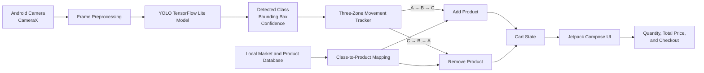

# DKU Smart Shopping Cart

> **2026 Dankook University Embedded Systems Term Project — Team G**

DKU Smart Shopping Cart is an Android-based shopping assistant that recognizes products through a smartphone camera and automatically updates a virtual cart. The project combines a custom YOLO object-detection model, TensorFlow Lite on-device inference, CameraX, and a Jetpack Compose user interface.

## Introduction

Fully automated stores can require expensive cameras, sensors, servers, and infrastructure. This project explores a smaller and more accessible alternative: using a normal Android smartphone as a smart shopping cart.

A user first selects a market and then scans products with the phone camera. The application detects supported products, displays bounding boxes and confidence scores, tracks each product across three screen zones, and updates the cart quantity and total price.

The final Android application performs object detection directly on the device. Therefore, the main recognition flow does not require a separate inference server.

## Key Features

* Real-time product detection through the Android camera
* Custom YOLO-based object-detection model
* Float32 TensorFlow Lite model for on-device inference
* Three-zone movement tracking
* Automatic product addition with the `A → B → C` sequence
* Automatic product removal with the `C → B → A` sequence
* Bounding boxes, class labels, and confidence scores
* Market selection and local product information
* Cart quantity controls and total-price calculation
* Scanner sound feedback when an item is added
* Checkout simulation

## Demo Video

[Watch the project demonstration on YouTube](YOUTUBE_LINK_HERE)

> **Before submission:** Replace `YOUTUBE_LINK_HERE` with the final YouTube video URL.

## System Architecture



## How It Works

1. The user selects a market.
2. CameraX continuously provides camera frames to the application.
3. Each frame is resized and passed to the TensorFlow Lite model.
4. The model returns the detected class, confidence score, and bounding box.
5. The center of the bounding box determines whether the product is in Zone A, B, or C.
6. A product moving through `A → B → C` is added to the cart.
7. A product moving through `C → B → A` is removed from the cart.
8. The application maps the detected class to local product information and updates the quantity and price.

## Training Data

### Data Source

No public internet dataset was used. The training data was collected directly by the project team.

### Data Collection and Annotation

* Team members recorded videos while holding each product.
* Products were filmed from different directions and under varied backgrounds and viewing conditions.
* The videos were separated into individual frames.
* Extracted frames were uploaded to Roboflow.
* Product bounding boxes were manually annotated.
* All classes were managed in one unified YOLO project.
* Background-only examples were treated as null/background data to reduce false product detections.

### Dataset Summary

| Item                 | Description                     |
| -------------------- | ------------------------------- |
| Data source          | Self-collected product videos   |
| Number of classes    | 8                               |
| Total labeled images | **INSERT_FINAL_IMAGE_COUNT**    |
| Annotation type      | Object-detection bounding boxes |
| Annotation platform  | Roboflow                        |
| Dataset format       | YOLO format                     |
| Public dataset link  | Not applicable                  |

> **Before submission:** Replace `INSERT_FINAL_IMAGE_COUNT` with the exact number of labeled images in the final dataset. The exact total is not recorded in the public repositories.

### Product Labels

1. `Sweet_and_sour`
2. `digest`
3. `free_time`
4. `miz`
5. `pringles`
6. `brownie_box`
7. `twix`
8. `gatorade_bottle`

## Model Pipeline


The trained model is stored in the Android application as:

```text
app/src/main/assets/best_float32.tflite
```

## Technology Stack

| Area                | Technology                  |
| ------------------- | --------------------------- |
| Mobile application  | Android, Kotlin             |
| User interface      | Jetpack Compose, Material 3 |
| Camera              | CameraX                     |
| Object detection    | Custom YOLO-based model     |
| Mobile inference    | TensorFlow Lite             |
| Dataset management  | Roboflow                    |
| Model training      | Google Colab                |
| Product information | Local JSON database         |
| Prototype server    | Python, FastAPI, OpenCV     |

## Current Limitations

* The current model supports only eight product classes.
* Recognition performance may decrease under severe blur, occlusion, or unfamiliar backgrounds.
* Fast-falling products are difficult to detect because they remain in each zone for only a short time and may appear blurred in ordinary smartphone-camera frames.
* Product and stock data are stored locally for demonstration purposes.
* The application does not currently include user registration or login.

## Future Work

* Expand the dataset to at least 50 product classes
* Collect more data under diverse lighting, angles, and backgrounds
* Improve fast-object detection with a higher-frame-rate or slow-motion camera
* Add user authentication
* Connect the application to a real product and inventory database

## Project Scope

This project is an academic prototype created to demonstrate how mobile object detection can support shoppers without requiring the infrastructure of a fully automated store.
